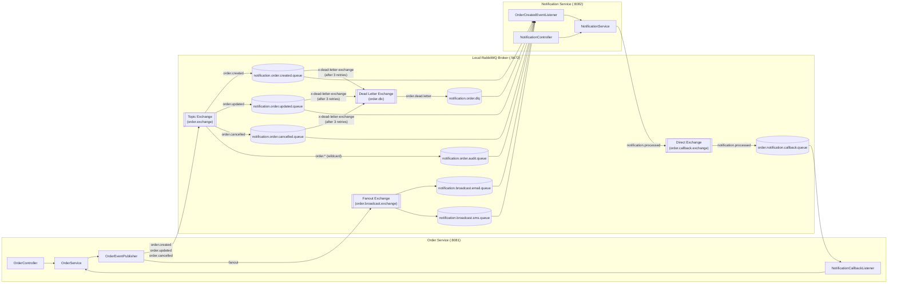

# Spring Boot Microservices + RabbitMQ Best Practices Reference (No Docker)

A complete, production-grade reference architecture for event-driven microservices using **Spring Boot 4 (Java 21)**, **Spring AMQP (RabbitMQ)**, and **H2 In-Memory Database** — designed to run **100% locally without Docker**.

---

## Architecture & RabbitMQ Topology



### Key Microservice & RabbitMQ Features Included
1. **Topic Exchange (`order.exchange`)**:
   - Exact routing keys: `order.created`, `order.updated`, `order.cancelled`
   - Wildcard routing (`order.*`): Automatically copies every order event into `notification.order.audit.queue` for audit logging.
2. **Fanout Exchange (`order.broadcast.exchange`)**:
   - Broadcasts system announcements simultaneously to `notification.broadcast.email.queue` and `notification.broadcast.sms.queue`.
3. **Direct Exchange Bidirectional Choreography (`order.callback.exchange`)**:
   - When `notification-service` processes an `OrderCreatedEvent`, it publishes a `NotificationProcessedEvent` back to `order-service`, which transitions the order status from `CREATED` -> `PROCESSING`.
4. **Dead Letter Exchange (`order.dlx`) & Dead Letter Queue (`notification.order.dlq`)**:
   - Queues are configured with `x-dead-letter-exchange` and `x-dead-letter-routing-key`.
   - Consumer retry with exponential backoff (`max-attempts: 3`, `1000ms -> 2000ms -> 4000ms`) and `default-requeue-rejected: false`.
   - Failed messages are captured by the DLQ listener and persisted in `dead_letter_messages` for inspection and resolution via REST APIs.
5. **Publisher Confirms & Returns**:
   - `publisher-confirm-type: correlated` & `publisher-returns: true` with `ConfirmCallback` (ACK/NACK logging) and `ReturnsCallback` (unroutable message handling).
6. **Idempotent Consumer Pattern**:
   - Unique constraint on `event_id` (`existsByEventId`) prevents duplicate notifications when messages are redelivered or republished.

---

## Running Locally (Without Docker)

### 1. Start Local RabbitMQ Server
Install RabbitMQ locally (on Windows via Installer, Chocolatey `choco install rabbitmq`, or Scoop `scoop install rabbitmq`):
- **AMQP Port**: `localhost:5672`
- **Management UI**: `http://localhost:15672` (`guest` / `guest`)

### 2. Start `orders` Service (Port `8081`)
```powershell
cd orders
.\mvnw.cmd spring-boot:run
```
- H2 Console: `http://localhost:8081/h2-console` (JDBC URL: `jdbc:h2:mem:orderdb`, User: `sa`, Password: empty)

### 3. Start `notification` Service (Port `8082`)
```powershell
cd notification
.\mvnw.cmd spring-boot:run
```
- H2 Console: `http://localhost:8082/h2-console` (JDBC URL: `jdbc:h2:mem:notificationdb`, User: `sa`, Password: empty)

---

## Complete REST API Endpoints Reference

### Order Service (`http://localhost:8081`)

| Method | Endpoint | Description | RabbitMQ Pattern Triggered |
| :--- | :--- | :--- | :--- |
| `POST` | `/api/orders` | Create a new order | Publishes `OrderCreatedEvent` (`order.created`) + Audit (`order.*`) + Callback (`notification.processed`) |
| `GET` | `/api/orders` | Paginated & filterable orders (`?status=PROCESSING&customerEmail=...&page=0&size=10`) | — |
| `GET` | `/api/orders/{id}` | Get single order by UUID | — |
| `GET` | `/api/orders/customer/{email}` | Get all orders for a customer email | — |
| `GET` | `/api/orders/stats` | Order statistics (total orders, total revenue, counts by status) | — |
| `PUT` | `/api/orders/{id}` | Update order productName, amount, customerEmail | Publishes `OrderUpdatedEvent` (`order.updated`) |
| `PATCH` | `/api/orders/{id}/status` | Update order status (`CREATED`, `PROCESSING`, `COMPLETED`, `CANCELLED`) | Publishes `OrderUpdatedEvent` (`order.updated`) |
| `POST` | `/api/orders/{id}/cancel` | Cancel an order with a reason | Publishes `OrderCancelledEvent` (`order.cancelled`) |
| `DELETE` | `/api/orders/{id}` | Delete an order | — |
| `POST` | `/api/orders/{id}/republish?eventId=...` | Republish `OrderCreatedEvent` (pass existing `eventId` to test **Idempotency**) | Publishes `OrderCreatedEvent` (`order.created`) |
| `POST` | `/api/orders/messaging/broadcast` | Broadcast a system alert to all channels | Publishes `SystemBroadcastEvent` to **Fanout Exchange** (`order.broadcast.exchange`) |
| `POST` | `/api/orders/messaging/simulate-dlq` | Create a poison-pill order (`FAIL-POISON-PILL-PRODUCT`) | Triggers **3 Consumer Retries** with exponential backoff -> routes to **DLQ** (`notification.order.dlq`) |
| `GET` | `/api/orders/test` | Health check | — |

---

### Notification Service (`http://localhost:8082`)

| Method | Endpoint | Description |
| :--- | :--- | :--- |
| `GET` | `/api/notifications` | Paginated & filterable notifications (`?customerEmail=...&isRead=false&type=ORDER_CREATED&page=0&size=10`) |
| `GET` | `/api/notifications/stats` | Notification metrics (unread/read counts, counts by type, DLQ counts, audit log counts) |
| `GET` | `/api/notifications/{id}` | Get notification by UUID |
| `GET` | `/api/notifications/order/{orderId}` | Get all notifications for a specific order |
| `GET` | `/api/notifications/customer/{email}` | Get all notifications for a customer email |
| `POST` | `/api/notifications` | Create a custom notification manually |
| `PATCH` | `/api/notifications/{id}/read` | Mark a single notification as read |
| `PATCH` | `/api/notifications/read-all?customerEmail=...` | Mark all unread notifications as read for a customer |
| `DELETE` | `/api/notifications/{id}` | Delete a notification |
| `GET` | `/api/notifications/dlq` | Inspect Dead Letter Queue (DLQ) messages (`?resolved=false`) |
| `GET` | `/api/notifications/dlq/{id}` | Get a single DLQ message with failure metadata |
| `PATCH` | `/api/notifications/dlq/{id}/resolve` | Mark a DLQ message as resolved |
| `DELETE` | `/api/notifications/dlq/{id}` | Delete a DLQ message |
| `GET` | `/api/notifications/audit` | Inspect Topic Wildcard (`order.*`) audit logs (`?routingKey=order.created`) |
| `GET` | `/api/notifications/test` | Health check |

---

## Step-by-Step cURL Testing Guide

### 1. Create an Order (Tests Topic Exchange + Wildcard Audit + Direct Callback)
```bash
curl -X POST http://localhost:8081/api/orders \
  -H "Content-Type: application/json" \
  -d '{
    "productName": "MacBook Pro M4",
    "amount": 2499.99,
    "customerEmail": "alice@example.com"
  }'
```
> Immediately after creation, `notification-service` consumes `order.created`, creates a notification, and sends a `NotificationProcessedEvent` callback to `order-service`, updating the order status from `CREATED` to `PROCESSING`.

### 2. Update Order Status (Tests `order.updated` Routing)
```bash
curl -X PATCH http://localhost:8081/api/orders/{ORDER_ID}/status \
  -H "Content-Type: application/json" \
  -d '{
    "status": "COMPLETED"
  }'
```

### 3. Cancel an Order (Tests `order.cancelled` Routing)
```bash
curl -X POST http://localhost:8081/api/orders/{ORDER_ID}/cancel \
  -H "Content-Type: application/json" \
  -d '{
    "reason": "Customer requested cancellation"
  }'
```

### 4. Test Fanout Exchange Broadcast (Delivers to Both Email & SMS Queues)
```bash
curl -X POST http://localhost:8081/api/orders/messaging/broadcast \
  -H "Content-Type: application/json" \
  -d '{
    "title": "Scheduled Maintenance",
    "message": "System maintenance window at 02:00 UTC."
  }'
```

### 5. Test Consumer Retry + Dead Letter Queue (DLQ)
```bash
curl -X POST "http://localhost:8081/api/orders/messaging/simulate-dlq?customerEmail=alice@example.com"
```
Wait ~7 seconds (3 retry attempts: 1s, 2s, 4s), then inspect the DLQ in `notification-service`:
```bash
curl http://localhost:8082/api/notifications/dlq
```

### 6. Inspect Wildcard Audit Logs (`order.*`) & Stats
```bash
curl http://localhost:8082/api/notifications/audit
curl http://localhost:8082/api/notifications/stats
curl http://localhost:8081/api/orders/stats
```
